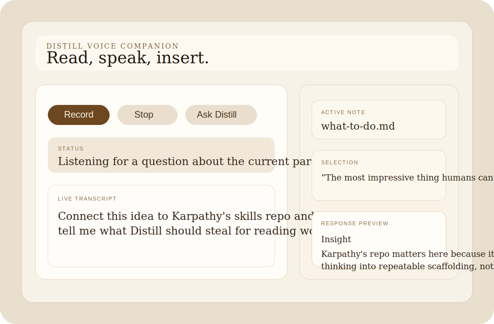

# Distill Voice Companion

Obsidian-first voice companion for Distill. Read a note, press a hotkey, speak your question, and insert an inline callout without leaving the document.



## MVP Decisions

1. **Surface**: Obsidian plugin first. It matches Fisher's reading habit, keeps context binding trivial, and avoids a second desktop shell before the loop is proven.
2. **Interaction model**: one-shot question to one callout for v1. Threaded chat can wait until insertion quality and habit frequency are validated.
3. **TTS**: wave 2. The v1 ship goal is `read -> speak -> insert`; read-back adds polish but is not the bottleneck.
4. **Repo location**: keep it inside this monorepo for now as `obsidian-distill-voice/`. The plugin is still reusing Distill adapters and prompt logic, so the co-location cost is lower than a second release workflow.
5. **UX references**: borrow hotkey discipline from Copilot for Obsidian and contextual relevance from Smart Connections, but keep the UI lighter and more editorial than chat-panel-heavy plugins.

## Install

```bash
cd obsidian-distill-voice && npm install && npm run build
cp manifest.json main.js styles.css "$VAULT/.obsidian/plugins/obsidian-distill-voice/"
Enable "Distill Voice Companion" inside Obsidian Community Plugins
```

## Usage

Open any markdown note, trigger `Mod+Shift+V`, record a question, then insert the generated callout at the current cursor.

## What This Scaffold Includes

- A floating voice modal with recording controls, live transcript, response preview, and contextual note metadata.
- STT routing for `macos-native` and `whisper-cli`, with live browser speech preview when Web Speech is available.
- LLM routing for `claude-code` and `anthropic`, reusing Distill's adapters and robust JSON parsing helpers.
- Inline markdown callout insertion that maps Distill callout types to Obsidian admonitions.
- A settings tab for LLM backend, STT backend, hotkey hint, language, and whisper paths.

## Known Gaps

- Hotkey changes in the settings tab apply on plugin reload; Obsidian's native Hotkeys panel still overrides everything.
- TTS is intentionally left for wave 2.
- Browser live transcript depends on Web Speech availability in the desktop runtime; `whisper-cli` still finalizes after stop even when live preview is unavailable.
